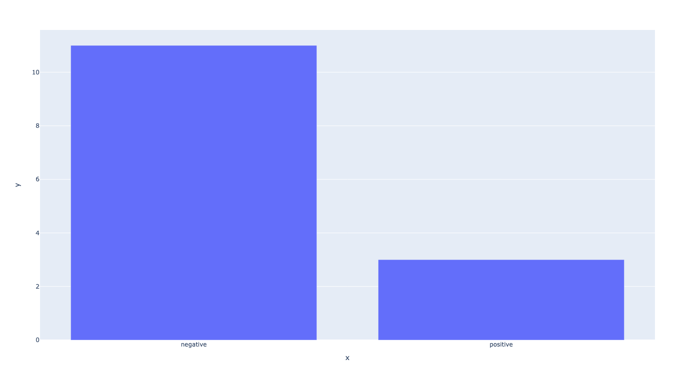

# Al Jazeera Article Scraper

Scrapes the Al-Jazeera website, parses the articles present in it and generates sentiment for the article

## Usage

run the following commands to exactly replicate the process

1. Create python virtual env using `python -m venv venv`
2. Install all the required packages using `pip install -r requirements.txt` 
3. Run the following command to replicate the results `python scraper.py` which generates the `results.json` file.

## JSON Schema

The file contains the contents in the following JSON format
```json
[
    {
        "link": "...", # Link to the site
        "title": "...", # Title of the article
        "text": "...", # Content of the article
        "sentiment": "..." # Sentiment of the article
    }
]
```

## Plot



## Observations
1. Most of the articles that are present are negatively inclined.
2. With the help of attributes we can easily extract what we want from a website.
3. With the help of Article from newspaper lib it is very easy to extract the articles from a site.

### Overall runtime of the Script is around 14s